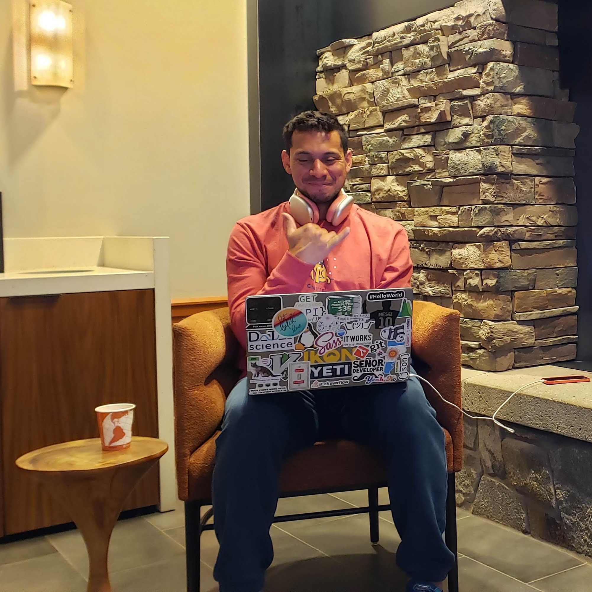
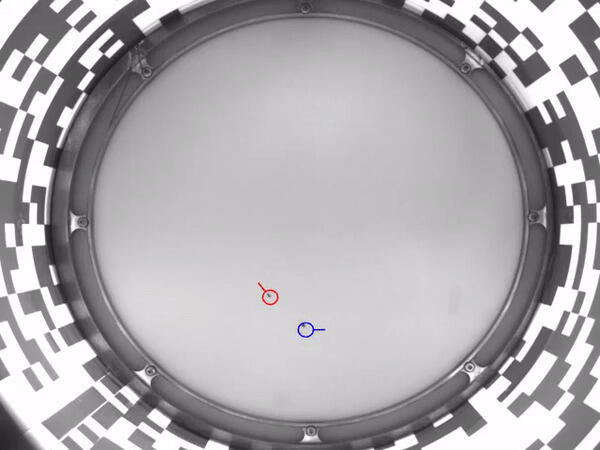
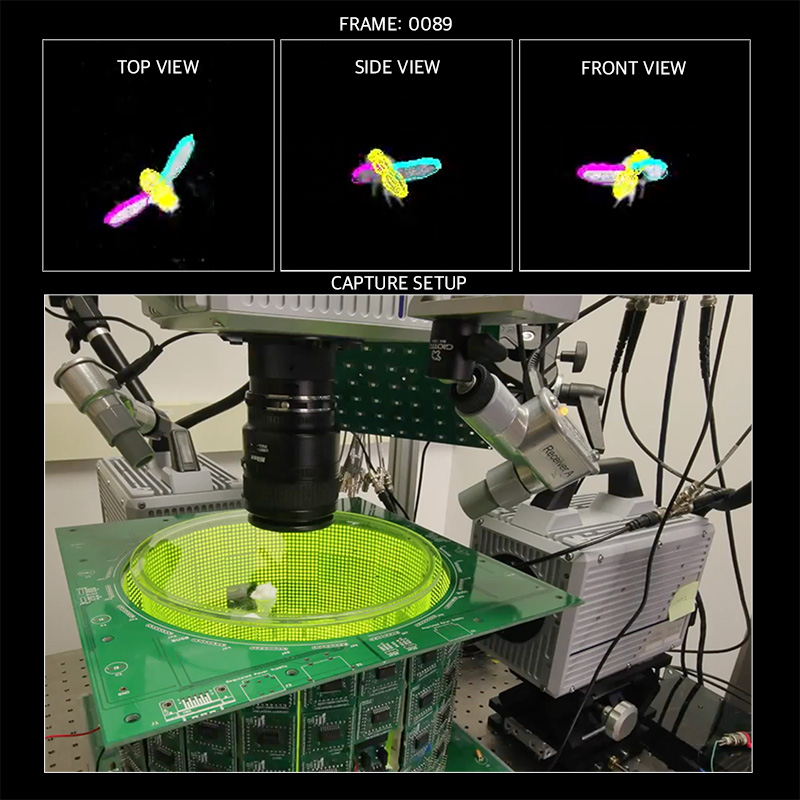
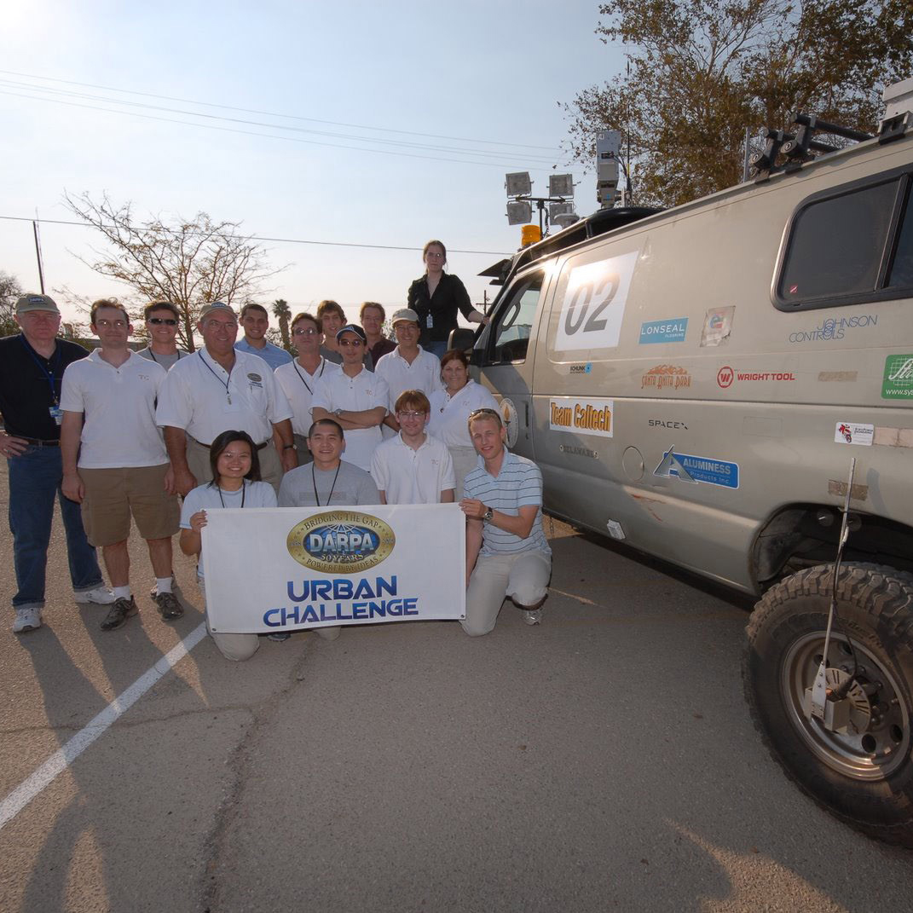

  

##  I'm Cisco, aka @datasith.

<table><tr>
<td  style="width:200px">

</td>  
<td>

• I am a data scientist (by day)

• My background is a mix of electrical engineering, robotics, and computer vision

• My current interests lie on building computer vision architectures using hybrid (edge-cloud) infra

• I (used to) run a <b><a href="https://youtube.com/datasith">YouTube channel</a></b> to teach *anyone* about DIY electronics and data science

• When I'm not coding I enjoy running 🏃 snowboarding 🏂 boxing 🥊 and watching/playing fútbol ⚽

</td>
</tr>
</table>

 

### Projects
<table><tr>
  <td>
    <h3>:robot: Studying Robot-Fly Visual Interactions</h3>
    
Together with <a href="https://github.com/peterpolidoro">@peterpolidoro</a>, we built a real-time, vision-based controlled, XY-stage to move a magnet within a chamber to study visually mediated responses of walking fruit flies.

    

      
Publications:

      <ul>
        <li>
          Zabala et al.,           
          <a href="https://www.cell.com/current-biology/fulltext/S0960-9822(12)00577-5">
            "A simple strategy for detecting moving objects"</a>,
          <i>Current Biology (Cell Press)</i>, 2012.
        </li>
      </ul>
    

  </td>
  <td>
    
  </td>
</tr><tr>   
  <td>
    <h3>:mosquito: Tracking Insect Wings and Body Kinematics</h3>
    
I built a 3D, high-speed video, auto-capture rig to observe visually mediated responses of fruit flies. The responses were elicited by a self-triggered LED chamber surrounding the flight volume. 
    

    

      
Publications:

      <ul>
        <li>
          Zabala et al.,           
          <a href="https://journals.biologists.com/jeb/article/212/9/1307/19160/Wing-and-body-motion-during-flight-initiation-in">
            "Wing and body motion during flight"</a>,
          <i>Journal of Exp. Bio.</i>, 2009.
        </li>
      </ul>
    

  </td>
  <td>
    
  </td>
</tr><tr> 
  <td>
    <h3>:racing_car: Team Caltech - DARPA Urban Challenge</h3>
    
Together with fellow students, post-docs, and professors, we built an autonomous ground vehicle capable of maneuvering a 60 mile course in a mock urban environment in under 6 hours.

    

      
Publications:

      <ul>
        <li>
          Burdick et al.,           
          <a href="http://users.cms.caltech.edu/~murray/preprints/bur+07-dgc.pdf">
            "Sensing, navigation and reasoning"</a>, 
          <i>DARPA Technical Report</i>, 2007.
        </li>
      </ul>
      
Articles:

      <ul>
        <li>
          Zabala, F. 
          <a href="https://medium.com/@datasith/how-to-fall-in-love-with-computer-vision-4f899ff51ecd">
            "How to fall in love with CV"</a>, 
          <i>Medium</i>, 2022 (last accessed).
        </li>
      </ul>    
    
    
    
  </td>
  <td>
    
  </td>
</tr></table>

### Tools and Tech
<table>
  <tr>
    <td>• Languages</td> 
    <td>
    
    
          
    </td>
  </tr>
  <tr>
    <td>• Platforms</td> 
    <td>
    </td>
  </tr>    
  <tr>
    <td>• Utilities</td>
    <td>          
    
    </td>
  </tr>
</table>
