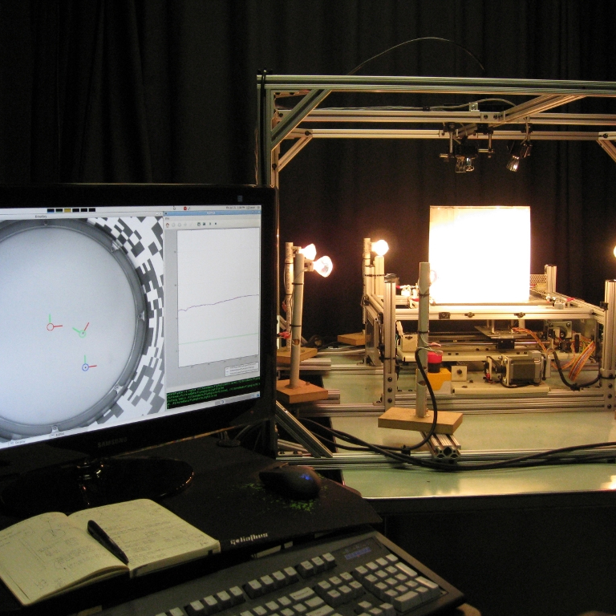

  

## Hi, I'm Cisco! | @datasith

<table><tr>
<td  style="width:200px">

</td>  
<td>

• I am a Data Scientist 

• My background is a mix of Electrical Engineering, Robotics, and Computer Vision 

• My Machine and Deep Learning work is in the areas of Computer Vision, Extended Reality, and Responsible AI

• I also run a <b><a href="https://youtube.com/datasith">YouTube channel</a></b> to teach *anyone* about DIY Electronics and Data Science

• When I'm not coding, I enjoy running 🏃 snowboarding 🏂 and playing/watching fútbol ⚽

</td>
</tr>
</table>

<!-- -->
 

<!--

-->

### Projects
<table><tr>
  <td>
    <h3>:robot: Studying Robot-Fly Visual Interactions</h3>
    
Together with <a href="https://github.com/peterpolidoro">@peterpolidoro</a>, we built a real-time, vision-based controlled, XY-stage to move a magnet within a chamber to study visually mediated responses of walking fruit flies. (<a href="https://pubmed.ncbi.nlm.nih.gov/22727703/">publication</a>)

    <a href="">:books: Read more</a>
  </td>
  <td>
    
  </td>
</tr><tr>   
  <td>
    <h3>:fly: Tracking Insect Wings and Body Kinematics</h3>
    
I built a 3D, high-speed video, auto-capture rig to observe visually mediated responses of fruit flies. The responses were elicited by a self-triggered LED chamber surrounding the flight volume. (<a href="https://journals.biologists.com/jeb/article/212/9/1307/19160/Wing-and-body-motion-during-flight-initiation-in">publication</a>)

    <a href="">:books: Read more</a>
  </td>
  <td>
    
  </td>
</tr><tr> 
  <td>
    <h3>:racing_car: Team Caltech - DARPA Urban Challenge</h3>
    
Together with fellow students, post-docs, and professors, we built an autonomous ground vehicle capable of maneuvering a 60 mile course in a mock urban environment in under 6 hours.

    <a href="">:books: Read more</a>
  </td>
  <td>
    
  </td>
</tr></table>

### Tools and Tech

<!--
<h1 align="center">Hi 👋, I'm Cisco</h1>
<h3 align="center">Data Scientist @ Walmart Global Tech</h3>

### Open source

### Latest blogs posts

 

   
   
   
  
   
  
  
   
  
   
  

 

  

-->
